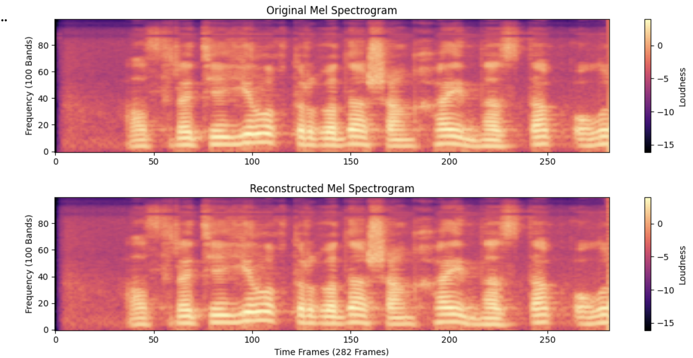
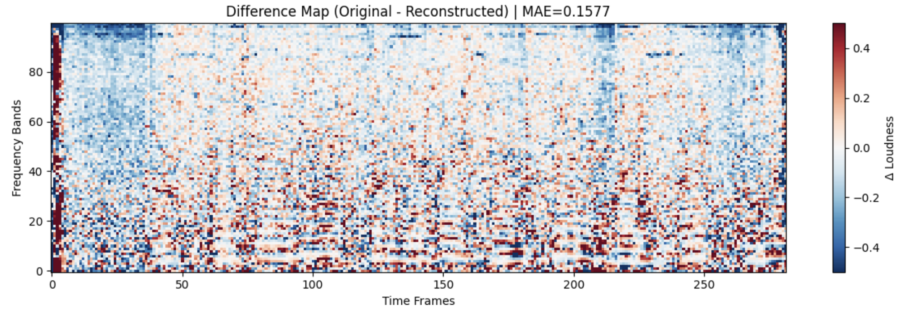

## Start

Task that will allow you to understand how our input and output data looks like: `Audio to(->) Mel conversion to(->) Audio (via neural vocoder)`

## Why This Matters

Our DiT model will:
- INPUT: Mel spectrograms (what you'll create)
- OUTPUT: Mel spectrograms (what you'll reconstruct)
- VOCODER: Converts mel → audible speech

Understanding mel ↔ audio conversion is foundational for debugging 
training issues later.

### Task pipeline

1. Libraries to use:
```bash
uv pip install vocos # for the Mel construction and reconstruction
uv pip install torchaudio # to load the audio and resample 
uv pip install matplotlib # visually see what Mel is.
uv pip install torchcodec # required for torchaudio to work
```

2. Model to use [vocos](https://huggingface.co/charactr/vocos-mel-24khz)


Create a pipeline for Audio2Mel and Mel2Audio inference using `vocos` as our Neural Vocoder.

1. 1 configuration class with arguments `audio_path`, `target_sr`, `target_duration`.
2. 1 main class that will have `waveform2mel`, `mel2waveform` methods that will convert from waveform to mel and reverse. You can use 2 methods from vocos lib that does it for you:

```python
vocos.feature_extractor()
vocos.decode()
```

3. Visualization to show the Mel Spectogram using `matplotlib` where you will need to show mel from original audio that you are using and reconstructed audio that you receive using your `mel2waveform` method.



So can you notice the difference between 2 Mels? Are we losing some information when we conver waveform2mel?? For me it's not clear, can we check it using some *quantity metrics*? Yes.

4. Quantity metrics. (MAE, MSE, Max Absolute Difference, SNR)

Write on by one in `torch` where you will compare 2 Mels, `original_mel_spec` vs `reconstructed_mel_spec`

| Metric | Purpose |
|--------|---------|
| MAE | Mean absolute error per bin |
| MSE | Main DiT loss function — penalizes large errors quadratically |
| Max Absolute Diff | Worst-case error |
| SNR (dB) | Signal-to-noise ratio |
| Pearson Correlation | Structural similarity |

5. Sanity Check

After computing metrics, verify:
- [ ] MAE < 0.2 (acceptable reconstruction)
- [ ] Correlation > 0.99 (structure preserved)
- [ ] SNR > 20 dB (good fidelity)

If your values are wildly different, something is wrong with your pipeline.

Please create a difference_map with `RdBu_r`, it will show red/blue spots where reconstruction deviates

The colormap shows `Original - Reconstructed`:
| Color | Meaning |
|-------|---------|
| Blue | Vocos added energy |
| White | Perfect match |
| Red | Vocos lost energy |



## Questions:

Please answer them in notebook, it's important to understand those parts properly.

If your (audio_length==3.0 sec) and (Sample_rate=24000)

1. Your waveform tensor will be shape of [?, ???]. What do these two numbers represent?
2. And same for Mel Spectogram tensor will be shape of [?, ???, ???] 

High level understanding will be enough, but you are `math student` so you can try to receive those value of a Mel Spectogram [?, ???, ???] by math, not by code-magic. In [vocos-mel-24khz](https://huggingface.co/charactr/vocos-mel-24khz/tree/main) model, they have config file please fine it on the huggingface and that should be everything you need to receive those tensor values. 

If you will draw it paper that will also help to strengthen the understanding, for example draw a simple waveform representation and final Mel Spectogram and step by step draw how you received it, up to you.

If you will struggle with formulas let me know, I will provide some guidance, I just recently learned it myself, so I will recap it and provide math logic.
